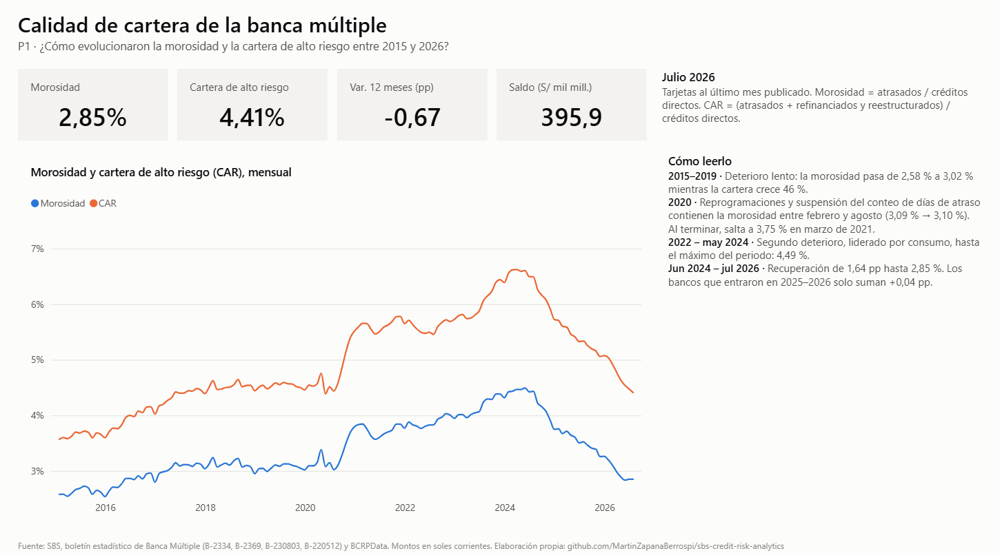
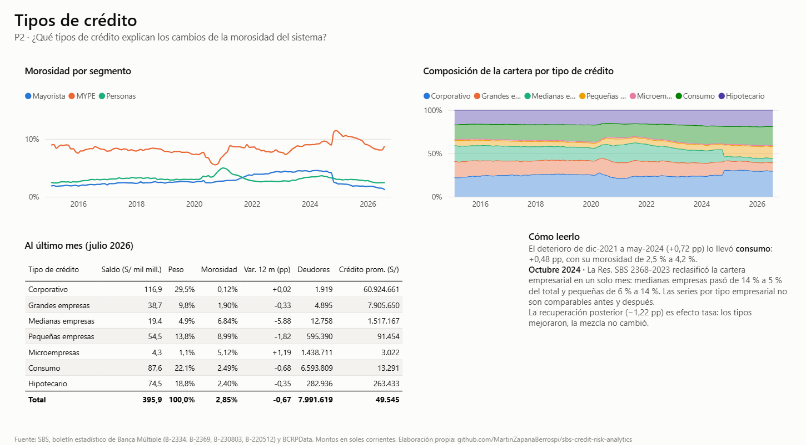
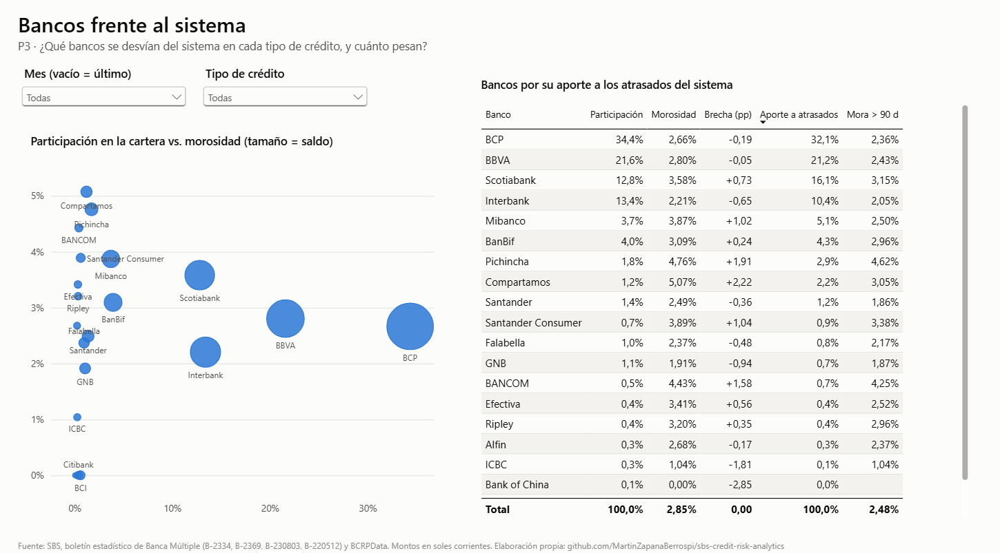
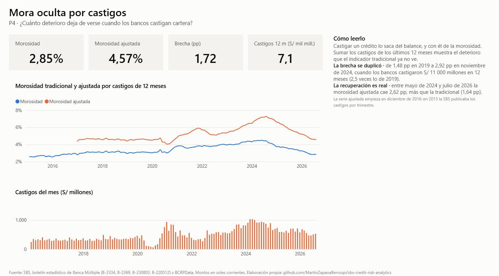
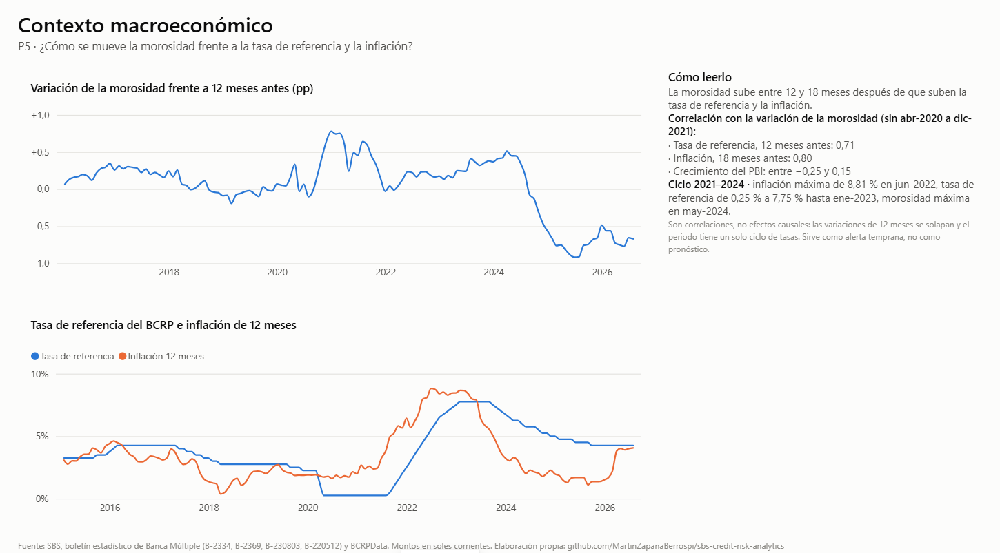

# SBS Credit Risk Analytics

[](https://github.com/MartinZapanaBerrospi/sbs-credit-risk-analytics/actions/workflows/ci.yml)
[](https://www.sbs.gob.pe/app/stats_net/stats/estadisticaboletinestadistico.aspx?p=1)
[](https://estadisticas.bcrp.gob.pe/estadisticas/series/)
[](powerbi/)
[](src/)
[](LICENSE)

Análisis de la **calidad de la cartera de créditos de la banca múltiple peruana** entre enero
de 2015 y julio de 2026, hecho de punta a punta con **datos públicos reales** de la
Superintendencia de Banca, Seguros y AFP (SBS) y del Banco Central de Reserva del Perú (BCRP):
desde la descarga de 687 archivos oficiales hasta un tablero en Power BI.



## La pregunta

¿Cómo evolucionó la calidad de la cartera de la banca múltiple, qué tipos de crédito y qué
bancos explican sus cambios, y cuánto de ese deterioro no se ve en el indicador de morosidad
tradicional?

## Hallazgos

1. **Dos ciclos de deterioro y una recuperación.** La morosidad pasó de 2,58 % (ene-2015) a un
   máximo de **4,49 % en mayo de 2024**, y bajó a **2,85 % en julio de 2026**. La cartera de alto
   riesgo llegó a 6,62 %.
2. **En 2020 la morosidad estuvo contenida por regulación.** Entre febrero y agosto de 2020 no
   se movió (3,09 % → 3,10 %) porque se suspendió el conteo de días de atraso. Al terminar la
   medida saltó a 3,75 %, y la de consumo llegó a 6,38 %.
3. **El segundo deterioro lo llevó el consumo.** De diciembre de 2021 a mayo de 2024 la
   morosidad subió 0,72 pp; consumo aportó 0,48 pp (su morosidad pasó de 2,5 % a 4,2 %).
4. **Octubre de 2024 rompe las series por tipo de crédito.** La Res. SBS 2368-2023 reclasificó
   la cartera empresarial en un solo mes: medianas empresas pasó de 14 % a 5 % del total y
   pequeñas de 6 % a 14 %. Comparar esos tipos a través de esa fecha lleva a conclusiones falsas.
5. **Los castigos esconden hasta 2,9 pp de morosidad.** Sumando los créditos castigados en 12
   meses, la morosidad de noviembre de 2024 sube de 3,92 % a 6,83 %. Aun así, la recuperación es
   real: la morosidad ajustada cae 2,62 pp desde mayo de 2024, más que la tradicional.
6. **La morosidad sigue a la política monetaria con 12 a 18 meses de rezago.** Su variación
   anual se correlaciona 0,71 con la de la tasa de referencia 12 meses antes, y 0,80 con la de la
   inflación 18 meses antes. Es co-movimiento, no causalidad (ver límites en la
   [Fase 5](docs/05_analisis.md)).

## El tablero

El informe no está publicado en la web de Power BI: se guarda como proyecto PBIP, con el modelo
y el informe en texto. Para abrirlo, ver [powerbi/README.md](powerbi/README.md).

| | |
|---|---|
|  **2. Tipos de crédito.** Morosidad por segmento, composición de la cartera y detalle al último mes. |  **3. Bancos.** Participación frente a morosidad, y brecha y aporte de cada banco a los atrasados del sistema, con filtros de mes y tipo. |
|  **4. Mora oculta.** Morosidad tradicional y ajustada por castigos, y flujo mensual de castigos. |  **5. Contexto macro.** Variación de la morosidad frente a la tasa de referencia y la inflación. |

La página [6. Notas](docs/img/06_notas.png) reúne definiciones, fuentes, rupturas de serie y
validaciones.

## Cómo se construyó

Cada fase tiene su documento, con lo que se hizo, lo que se encontró y lo que se decidió:

| Fase | Qué se hizo | Documento |
|---|---|---|
| 0. Definición | Pregunta, usuario, KPIs, alcance y verificación de que las fuentes existen y se pueden descargar | [00_definicion.md](docs/00_definicion.md) |
| 1. Adquisición | Descarga idempotente de 5 cuadros SBS × 139 meses y 4 series del BCRP, con manifiesto y hash SHA-256 | [01_adquisicion.md](docs/01_adquisicion.md) |
| 2. Calidad | 10 problemas de estructura, 22 bancos detrás de 32 nombres, 5 inconsistencias entre cuadros y 7 validaciones automáticas | [02_calidad.md](docs/02_calidad.md) |
| 3. Transformación | raw → staging → modelo en estrella, con perímetro único de entidades | [03_transformacion.md](docs/03_transformacion.md) |
| 4. Modelado | 14 relaciones y 28 medidas DAX, validadas contra Python | [04_modelado.md](docs/04_modelado.md) |
| 5. Análisis | Respuestas cuantificadas: descomposición tasa/mezcla, brechas por banco, mora ajustada y rezagos macro | [05_analisis.md](docs/05_analisis.md) |
| 6. Tablero | 6 páginas en Power BI (PBIP) | [powerbi/](powerbi/) |
| 7. Hallazgos | Conclusiones de arriba | este README |
| 8. Automatización | 37 pruebas (parser con archivos reales y modelo curado) en GitHub Actions | [.github/workflows/ci.yml](.github/workflows/ci.yml) |

**Lo que valida el resultado.** El pipeline reconstruye cifras que la SBS publica en otros
cuadros: la morosidad por tipo de crédito calculada desde los montos coincide con la publicada en
**1 099 comparaciones**, con una diferencia máxima de 0,0085 pp. Las 4 diferencias encontradas
están investigadas y documentadas con la nota de la SBS que las explica.

## Cómo reproducirlo

```bash
pip install -r requirements.txt
python -m src.extract      # descarga ~690 archivos de la SBS y 4 series del BCRP (~31 MB)
python -m src.transform    # raw → staging → data/curated
python -m src.validate     # compara con las cifras oficiales; falla si algo no cuadra
python -m src.analysis     # tablas de soporte del análisis en reports/analisis/
pytest -q
```

Para ver solo el tablero no hace falta ejecutar nada: `data/curated/` viene en el repositorio.

## Estructura

```
├── src/
│   ├── config.py          # Periodo, cuadros SBS, series BCRP, rutas
│   ├── extract.py         # Fase 1: descarga + manifiesto
│   ├── parse_sbs.py       # Lector de cada cuadro de la SBS
│   ├── transform.py       # Fase 3: staging y modelo en estrella
│   ├── validate.py        # Validaciones contra cifras publicadas
│   └── analysis.py        # Fase 5
├── data/
│   ├── raw/manifest.csv   # Trazabilidad de cada archivo descargado (los archivos no se versionan)
│   ├── reference/         # Mapa de entidades con su resolución SBS
│   └── curated/           # Lo que lee Power BI
├── powerbi/               # Proyecto PBIP (TMDL + PBIR)
├── reports/               # Validaciones y tablas del análisis
├── tests/                 # Pruebas, con archivos reales de los casos difíciles
└── docs/                  # Un documento por fase + capturas del tablero
```

## Limitaciones

- **Solo banca múltiple.** Cajas municipales, cajas rurales y financieras tienen sus propios
  boletines y quedan fuera.
- **Sin morosidad por región.** La SBS publica créditos por departamento, pero no su morosidad.
- **Series por tipo de crédito empresarial** no comparables antes y después de octubre de 2024.
- **Los deudores del sistema** saltan en 2025–2026 sobre todo por las financieras que se
  convirtieron en banco, no por nuevos clientes.
- **El análisis macro es correlacional**, sobre un solo ciclo de tasas.

## Fuentes y licencia

Datos: [SBS, boletín estadístico de Banca Múltiple](https://www.sbs.gob.pe/app/stats_net/stats/estadisticaboletinestadistico.aspx?p=1)
y [BCRPData](https://estadisticas.bcrp.gob.pe/estadisticas/series/). Son información pública
de ambas instituciones y cada visual del tablero cita su fuente. Código bajo licencia
[MIT](LICENSE).
