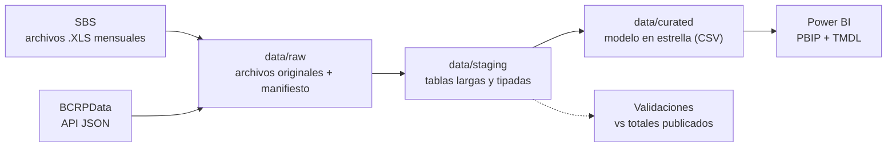

# Fase 0 — Definición del proyecto

> Estado: **cerrada** (2026-09-22). Todo lo que este documento afirma sobre las fuentes se
> comprobó contra los servidores de la SBS y del BCRP en esa fecha. La sección
> [Reconocimiento de las fuentes](#4-reconocimiento-de-las-fuentes) detalla qué se probó.

## 1. El problema

La morosidad es el primer indicador que mira cualquier área de riesgo de crédito, pero leída
sola engaña: sube o baja según qué tipo de crédito crece, cuánto refinancia cada banco y
cuánta cartera se castiga (se retira del balance) antes de que aparezca como atrasada.

**Pregunta central.** ¿Cómo evolucionó la calidad de la cartera de la banca múltiple peruana
entre enero de 2015 y julio de 2026, qué tipos de crédito y qué bancos explican sus cambios,
y cuánto de ese deterioro no se ve en el indicador de morosidad tradicional?

**Usuario del tablero.** Un analista de riesgo de crédito que prepara el reporte mensual para
el comité de riesgos y necesita ubicar a su entidad frente al sistema.

### Preguntas que el tablero debe responder

| # | Pregunta | Dónde se responde |
|---|---|---|
| P1 | ¿Cómo evolucionaron la morosidad y la cartera de alto riesgo del sistema, y en qué meses se rompe la tendencia? | Página *Sistema* |
| P2 | ¿Qué tipos de crédito explican el cambio de la morosidad del sistema en cada periodo? | Página *Tipos de crédito* |
| P3 | ¿Qué bancos se desvían del sistema dentro de cada tipo de crédito, y cuánto pesan en él? | Página *Bancos* |
| P4 | ¿Cuánto sube la morosidad cuando se suman los castigos de los últimos 12 meses? | Página *Mora oculta* |
| P5 | ¿Cómo se mueve la calidad de cartera frente a la tasa de referencia, la inflación y la actividad económica? | Página *Contexto macro* |

P5 muestra co-movimientos. El proyecto **no** estima efectos causales.

## 2. Indicadores

Montos en miles de soles, tal como los publica la SBS. *Directos = Vigentes + Refinanciados y
reestructurados + Atrasados.*

| Indicador | Definición | Fuente |
|---|---|---|
| Créditos directos | Vigentes + Refinanciados y reestructurados + Atrasados | B-2334 |
| Morosidad | Atrasados / Directos | B-2334 |
| Cartera de alto riesgo (CAR) | (Atrasados + Refinanciados y reestructurados) / Directos | B-2334 |
| Morosidad ajustada por castigos | (Atrasados + castigos de 12 meses) / (Directos + castigos de 12 meses) | B-2334 + B-2369 |
| Morosidad por días de atraso | % de créditos con más de 30, 60, 90 y 120 días de atraso | B-220512 |
| Participación de mercado | Directos de la entidad / Directos del sistema | B-2334 |
| Crédito promedio por deudor | Directos / Número de deudores, por tipo de crédito | B-2334 + B-230803 |
| Variación interanual | Valor del mes frente al mismo mes del año anterior | Calculada |

Los tres primeros indicadores se calculan **desde montos** y no se promedian porcentajes. Así
el total del sistema o de un grupo de bancos siempre queda bien ponderado.

## 3. Alcance

**Incluido**
- Banca múltiple: todas las entidades que publica la SBS en cada mes, incluidas las que
  entraron, salieron o cambiaron de nombre en el periodo.
- Frecuencia mensual, de enero de 2015 a julio de 2026 (139 cortes).
- Contexto macroeconómico del BCRP con las mismas fechas.

**Fuera de alcance, y por qué**
- *Cajas municipales, cajas rurales y financieras.* Tienen sus propios boletines. Se podrán
  sumar después con el mismo pipeline.
- *Morosidad por departamento.* La SBS publica créditos y depósitos por zona geográfica
  (B-2314, B-2349), pero no su morosidad. Un análisis regional solo podría hablar de
  colocaciones, no de calidad de cartera.
- *Modelos predictivos.* Este es un proyecto de analítica descriptiva y diagnóstica.

## 4. Reconocimiento de las fuentes

### 4.1 SBS — boletín estadístico de Banca Múltiple

El portal de consulta (`sbs.gob.pe/app/stats_net/...`) responde con un desafío antibots a los
clientes que no son navegadores. **No se intenta evadirlo.** Cada cuadro enlaza a un archivo
estático en `intranet2.sbs.gob.pe` que sí se descarga de forma directa y tiene una URL
predecible:

```
https://intranet2.sbs.gob.pe/estadistica/financiera/{AAAA}/{Mes}/{Cuadro}-{mm}{AAAA}.XLS
Mes: Enero … Setiembre … Diciembre     mm: en fe ma ab my jn jl ag se oc no di
```

Se comprobó con peticiones `HEAD` la existencia de cada archivo, mes por mes, de 2015-01 a
2026-07:

| Cuadro | Contenido | Unidad | Meses disponibles |
|---|---|---|---|
| **B-2334** | Créditos directos por tipo de crédito y situación, por entidad | Miles de S/ | 139 / 139 |
| **B-220512** | Ratios de morosidad según días de incumplimiento, por entidad | % | 139 / 139 |
| **B-2369** | Flujo de créditos castigados por tipo de crédito, por entidad | Miles de S/ | 131 / 139 ¹ |
| **B-230803** | Número de deudores por tipo de crédito, por entidad | Deudores | 139 / 139 |
| **B-2362** | Morosidad por tipo y modalidad de crédito, por entidad | % | 139 / 139 ² |

¹ En 2015 solo existen los cierres de trimestre (marzo, junio, setiembre y diciembre). Por eso
la morosidad ajustada por castigos, que suma 12 meses, empieza en diciembre de 2016. En la
Fase 2 se confirmará si esos archivos trimestrales traen el flujo del mes o del trimestre.
² Solo publica porcentajes. Se usa para validar los cálculos, no como fuente de montos.

### 4.2 BCRP — BCRPData

API pública en JSON y sin clave:
`https://estadisticas.bcrp.gob.pe/estadisticas/series/api/{serie}/json/{inicio}/{fin}`

| Serie | Descripción | Periodos desde 2015-01 |
|---|---|---|
| PD04722MM | Tasa de referencia de la política monetaria | 140 |
| PN01273PM | IPC de Lima Metropolitana, variación % 12 meses | 140 |
| PN01210PM | Tipo de cambio bancario, promedio del periodo (S/ por US$) | 140 |
| PN01770AM | PBI, índice 2007 = 100 | 139 |

### 4.3 Problemas de calidad detectados en archivos de muestra

Se abrieron archivos de enero de 2015 y julio de 2026 de cada cuadro. Todo lo siguiente se
resolverá en las Fases 2 y 3:

1. **La extensión no dice el formato.** Todos terminan en `.XLS`, pero algunos son Excel 97
   (binario) y otros Excel 2007+ (zip). Por ejemplo, B-220512 es xlsx en 2015 y xls en 2026.
   El lector debe detectar el formato por los primeros bytes del archivo.
2. **La fila de encabezado se mueve.** Algunos meses traen una fila extra
   "Actualizado al dd-mm-aaaa" que desplaza la tabla. El encabezado se ubica buscando su
   texto, no por posición.
3. **Encabezados en varias filas.** B-2334 combina el tipo de crédito (fila 1) con la
   situación (fila 3). Hay que reconstruirlos antes de pasar a formato largo.
4. **Tabla ancha.** B-2362 pone un banco por columna; B-2334 pone un banco por fila y una
   combinación tipo × situación por columna. Todo se normaliza a formato largo.
5. **Las entidades cambian de nombre.** B. Continental → B. BBVA Perú, B. Financiero →
   B. Pichincha, B. de Comercio → BANCOM, "Banco BCI Perú" / "BCI Perú", "B. Efectiva*".
   Hace falta una dimensión de entidades con un identificador estable y todos sus alias.
6. **Nulos codificados.** Se usa `-` para "no aplica", y hay etiquetas con espacios al
   inicio o al final.
7. **Filas que no son datos.** Subtotales ("TOTAL BANCA MÚLTIPLE"), notas, fuentes y
   llamadas (`1/`, `*`). Los totales publicados se separan y sirven para validar.

## 5. Arquitectura prevista



| Capa | Contenido | ¿Se versiona? |
|---|---|---|
| `data/raw` | Archivos tal como se descargan, más un manifiesto con URL, fecha de descarga y hash SHA-256 | No (se regenera con un comando). Solo el manifiesto |
| `data/staging` | Una tabla larga por cuadro, con nombres y tipos limpios | No |
| `data/curated` | Hechos y dimensiones que lee Power BI | **Sí**, para abrir el tablero sin ejecutar el pipeline |

**Modelo en estrella previsto**

- Hechos: `fact_cartera` (entidad × tipo de crédito × mes, con montos por situación),
  `fact_castigos`, `fact_deudores`, `fact_morosidad_dias`, `fact_macro`.
- Dimensiones: `dim_fecha`, `dim_entidad` (id estable, nombre vigente, alias, primer y último
  mes publicado), `dim_tipo_credito`.

## 6. Cómo se mostrará el tablero

El informe **no se publica en la web de Power BI**. Para que se pueda revisar desde GitHub:

- El informe se guarda como **Power BI Project (PBIP)**, con el modelo en **TMDL**. Así las
  medidas DAX, las relaciones y el Power Query se pueden leer como texto en el repositorio.
- Cada página se exporta como imagen a `docs/img/` y se muestra en el README con su conclusión.
- Quien tenga Power BI Desktop puede clonar el repositorio y abrir el `.pbip` directamente,
  porque `data/curated` viaja en el repo.

## 7. Criterios de éxito

- [ ] Un solo comando descarga todo y es idempotente: no vuelve a bajar lo que ya tiene.
- [ ] El 100 % de los nombres de entidad publicados se asigna a un id de `dim_entidad`.
- [ ] La suma de las entidades coincide con la fila "TOTAL BANCA MÚLTIPLE" de cada mes
      (diferencia relativa < 0,01 %).
- [ ] La morosidad calculada desde B-2334 coincide con la publicada en B-2362 para el total
      del sistema (diferencia < 0,01 puntos porcentuales).
- [ ] Cada pregunta P1–P5 tiene una página del tablero y una conclusión escrita en el README.
- [ ] Pruebas automáticas del parser y de las validaciones en GitHub Actions.

## 8. Plan de fases

| Fase | Entregable | Documento |
|---|---|---|
| 0. Definición | Problema, KPIs, alcance y reconocimiento de fuentes | este archivo |
| 1. Adquisición | `src/extract` + `data/raw/manifest.csv` | `docs/01_adquisicion.md` |
| 2. Calidad | Perfilado de los 5 cuadros × 139 meses y diccionario de datos | `docs/02_calidad.md` |
| 3. Transformación | raw → staging → curated, mapa de entidades | `docs/03_transformacion.md` |
| 4. Modelado | Modelo en estrella + medidas DAX en TMDL | `docs/04_modelado.md` |
| 5. Análisis | Respuestas a P1–P5 con cifras | `docs/05_analisis.md` |
| 6. Tablero | PBIP + capturas | `powerbi/`, `docs/img/` |
| 7. Hallazgos | Conclusiones y limitaciones | README |
| 8. Automatización | Pruebas + GitHub Actions | `.github/workflows/` |
