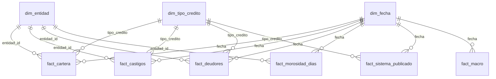

# Fase 4 — Modelado en Power BI

> Estado: **cerrada** (2026-09-22). El modelo se versiona como texto (TMDL) en
> [`powerbi/sbs_credit_risk.SemanticModel`](../powerbi/sbs_credit_risk.SemanticModel/definition).

## Modelo en estrella



- **14 relaciones**, todas de uno a varios y con filtro en una sola dirección, de la dimensión
  al hecho.
- **Las tablas de hechos están ocultas.** El informe solo usa dimensiones y medidas, así nadie
  arrastra una columna de saldo y obtiene una suma sin sentido.
- **`discourageImplicitMeasures`** está activado por la misma razón.
- **Una sola ruta que cambiar.** Todas las consultas leen `RutaDatos & "<tabla>.csv"`. Al clonar
  el repositorio en otra carpeta solo hay que editar ese parámetro.
- **Cultura `en-US`** en cada `Table.TransformColumnTypes`: los CSV usan punto decimal, y con la
  configuración regional en español Power Query leería `2.85` como `285`.

## Decisiones de DAX

### Los saldos no se suman entre meses

Un saldo de cartera es una foto a fin de mes. Sumar enero y febrero no significa nada. Por eso
todas las medidas de saldo se evalúan **en el último mes del contexto**:

```dax
Créditos directos =
VAR f = MAX ( dim_fecha[fecha] )
RETURN
    CALCULATE ( SUM ( fact_cartera[directos] ), dim_fecha[fecha] = f )
```

En un gráfico mensual, cada punto es su propio mes. En una tarjeta sin filtro de fecha, el valor
es julio de 2026. En un eje por año, cada año muestra diciembre. Las razones (`Morosidad`, `CAR`)
se construyen sobre estas medidas y heredan el mismo comportamiento.

### Ratios calculados desde montos

```dax
Morosidad = DIVIDE ( [Atrasados], [Créditos directos] )
```

La morosidad de un grupo de bancos o de un segmento se pondera sola por el saldo. Promediar la
morosidad de cada banco daría el mismo peso a Bank of China que a BCP.

### Ventana móvil sin inteligencia de tiempo

`dim_fecha` tiene un día por mes (el último), no un calendario diario. Por eso no se puede
marcar como tabla de fechas, y la ventana de 12 meses se escribe con filtros explícitos:

```dax
Castigos 12 meses =
VAR f = MAX ( dim_fecha[fecha] )
VAR ini = EOMONTH ( f, -12 )
RETURN
    IF (
        f >= DATE ( 2016, 12, 31 ),
        COALESCE (
            CALCULATE ( SUM ( fact_castigos[castigos] ), REMOVEFILTERS ( dim_fecha ), dim_fecha[fecha] > ini, dim_fecha[fecha] <= f ),
            0
        )
    )
```

Devuelve vacío antes de diciembre de 2016, porque en 2015 no hay flujos mensuales. Un banco sin
castigos en la ventana obtiene 0, no vacío, para que su morosidad ajustada sí se calcule.

### Lo que no es aditivo usa lo publicado

`Deudores del sistema` toma el total que publica la SBS, que ya descuenta al deudor repetido
entre bancos. Si hay un tipo de crédito seleccionado, usa el total de ese tipo; si no hay filtro,
el total consolidado. `Mora > 90 días` usa el dato del banco cuando hay uno solo, el publicado
para el sistema cuando no hay filtro de banco, y vacío cuando se filtra por tipo de crédito (la
SBS no lo publica por tipo).

## Medidas

28 medidas en la tabla `_Medidas`, agrupadas por carpeta:

| Carpeta | Medidas |
|---|---|
| 1. Cartera | Créditos directos (y en S/ miles de millones), Atrasados, Refinanciados y reestructurados, Morosidad, CAR, Morosidad hace 12 meses, Var. morosidad 12 meses (pp), Morosidad sin bancos nuevos, Participación en la cartera del tipo |
| 2. Castigos | Castigos del mes (y en S/ millones), Castigos 12 meses (y en S/ miles de millones), Morosidad ajustada, Brecha de mora oculta (pp) |
| 3. Bancos | Participación en el sistema, Morosidad del sistema, Brecha vs. sistema (pp), Aporte a los atrasados del sistema, Mora > 90 días |
| 4. Deudores | Deudores del sistema, Crédito promedio por deudor (S/) |
| 5. Macro | Tasa de referencia, Inflación 12 meses, Crecimiento del PBI 12 meses |
| 6. Etiquetas | Corte, Hito del mes |

Las medidas base tienen descripción en el TMDL, visible como ayuda emergente en Power BI Desktop.

## Validación contra Python

Con Power BI Desktop abierto, se consultó el modelo con DAX (a través del servidor MCP de
modelado de Power BI) y se comparó con [`reports/analisis/`](../reports/analisis/):

| Corte | Morosidad | Morosidad ajustada | Castigos 12 m (S/ mil mill.) | DAX = Python |
|---|---|---|---|---|
| Ene 2015 | 2,5774 % | — | — | ✅ |
| Dic 2016 | 2,7963 % | 4,3710 % | 3,876 | ✅ |
| Dic 2019 | 3,0190 % | 4,4968 % | 4,427 | ✅ |
| May 2024 | 4,4924 % | 7,1939 % | 10,221 | ✅ |
| Nov 2024 | 3,9164 % | 6,8316 % | 10,959 | ✅ |
| Jul 2026 | 2,8513 % | 4,5716 % | 7,138 | ✅ |

También coinciden la morosidad sin bancos nuevos (2,8141 % en julio de 2026) y, para
Scotiabank en medianas empresas, la participación (12,66 %), la morosidad (17,89 %), la brecha
(+11,05 pp) y el aporte a los atrasados (33,1 %).
